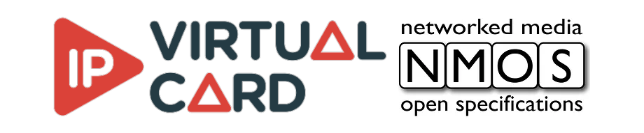

# NMOS IPVC Samples



The IP Virtual Card NMOS samples demonstrate the integration of several NMOS standards with the [DELTACAST IP Virtual Card](https://www.deltacast.tv/products/developer-products/ip-software/ip-virtual-card-smpte-st-2110-edition).

NMOS, as defined by AMWA (Advanced Media Workflow Association), is a set of specifications for IP-based media networks. It enables interoperability between compliant devices and systems, and provides a framework for the development of IP-based media solutions.

The NMOS IPVC samples showcase the basic structure and usage of the NMOS APIs in conjunction with [DELTACAST](https://www.deltacast.tv/) VideoMasterIP API. It can be used as a reference for implementing IPVC solutions in media production and distribution workflows using NMOS.

The samples include two main functionalities:

1. **Receiver Node Sample**: This sample demonstrates how to implement a receiver node that can discover, connect to, and display streams from NMOS-compliant sender nodes. The receiver node utilizes the NMOS IS-04 and IS-05 specifications for discovery and connection management. It can dynamically discover available sender nodes on the network, establish connections with them, and receive and display the video streams they send. This sample provides a practical example of how to integrate NMOS functionality into a receiver application.

2. **Sender Node Sample**: This sample shows how to implement a sender node that can stream a predefined pattern to NMOS-compliant receiver nodes. The sender node utilizes the NMOS IS-04 and IS-05 specifications for discovery and connection management. It generates a predefined video pattern and streams it to one or more receiver nodes on the network. This sample provides a practical example of how to integrate NMOS functionality into a sender application.

Both samples serve as reference implementations for developers looking to build NMOS-compliant receiver and sender nodes. They demonstrate the usage of the NMOS APIs, including discovery, connection management, and streaming. By studying and modifying these samples, developers can gain a better understanding of how to integrate NMOS functionality into their own applications with the [DELTACAST](https://www.deltacast.tv/) IP Virtual Card.

## Features
- Supports the following NMOS specifications:
  - [IS-04](https://specs.amwa.tv/is-04/): Discovery and Registration of NMOS Devices and Resources
  - [IS-05](https://specs.amwa.tv/is-05/): Connection Management
  - [IS-09](https://specs.amwa.tv/is-09/): System API
- Supports real-time media transport, discovery, and control over IP networks. NMOS IPVC Samples only demonstrate ST2110-20 video essence.
- Enables interoperability with other NMOS-compliant devices and systems.
- Supports PTP synchronization.
- Supports 1 stream per instance.

## Dependencies installation
### IP Virtual Card
To use those samples you must have a valid install of the [DELTACAST IP Virtual Card](https://www.deltacast.tv/products/developer-products/ip-software/ip-virtual-card-smpte-st-2110-edition). Those samples are compatible with IP Virtual Card versions 2.X, they might not be compatible with another major version without recompilation.
### Submodules
To run the NMOS IPVC Samples, the following dependencies are required. This project is directly using the [nmos-cpp](https://github.com/sony/nmos-cpp) library, which is a C++ open source implementation of the NMOS specifications. It is also using the [DELTACAST](https://www.deltacast.tv/) [video-viewer](https://github.com/deltacasttv/video-viewer) library, which is a C++ library for displaying video streams. To clone those repositories as submodules, use the following commands:
```bash
git submodule init
git submodule update
```

nmos-cpp and video-viewer have their own dependencies, which are listed below.
### Common dependencies
Dependencies required by both nmos-cpp and video-viewer.
#### [cmake](https://cmake.org/)
Install cmake with a method of your choice. For example, on Ubuntu, you can use the following command: `sudo apt-get install cmake`. CMake version 3.19 or higher is required.
#### [conan](https://conan.io/)
Install conan 1.X with a method of your choice. For example, on Ubuntu, you can use the following command: `sudo apt-get install python3-pip && sudo pip3 install conan==1.62.0`. Conan version should be at least 1.60. Conan 1.62 is recommended for nmos-cpp. Conan 2.X is not supported.

Execute the following command to avoid using incompatible versions of conan packages :
```shell
conan config set general.default_package_id_mode=minor_mode
```
### nmos-cpp installation and dependencies

nmos-cpp requires the manual installation of the DNS Service Discovery. All other dependencies are installed automatically in cmake using conan.

#### DNS Service Discovery
##### Windows

1. Download the [Bonjour SDK for Windows v3.0](https://developer.apple.com/download/more/?=Bonjour%20SDK%20for%20Windows) from Apple Developer Downloads
2. Run bonjoursdksetup.exe, which will install the necessary files in e.g. *C:\Program Files\Bonjour SDK*
3. The critical files for building this software are:
   - *Bonjour SDK\Include\dns_sd.h*
   - *Bonjour SDK\Lib\x64\dnssd.lib*
4. The Bonjour service itself needs to be installed on the system where this software is run.  
   The installer is included in the SDK:
   - *Bonjour SDK\Installer\Bonjour64.msi*

##### Linux

The [Avahi](https://www.avahi.org/) project provides a DNS-SD daemon for Linux, and the *avahi-compat-libdns_sd* library which enables applications to use the original Bonjour *dns_sd.h* API to communicate with the Avahi daemon.

For example, to install the Bonjour compatibility library, Name Service Switch module, and Avahi tools on Ubuntu:
```sh
sudo apt-get install -f libavahi-compat-libdnssd-dev libnss-mdns avahi-utils
```

Alternatively, [Apple's mDNSResponder (also known as ``mdnsd``)](https://github.com/apple-oss-distributions/mDNSResponder) can itself be built from source for Linux. Version 878.200.35 has been tested.

The ``mDNSResponder`` build instructions are quite straightforward. For example, to build and install:
```sh
cd mDNSPosix
make os=linux
sudo make os=linux install
```

(The [Getting Started](Getting-Started.md) instructions explain how to set ``NMOS_CPP_USE_AVAHI`` (BOOL) to ``0`` (false) in order to use ``mDNSResponder`` when building nmos-cpp.)

Notes:
- The [unicast](../Development/third_party/mDNSResponder/unicast.patch) and [permit-over-long-service-types](../Development/third_party/mDNSResponder/permit-over-long-service-types.patch) patches found in this repository are recommended to build the ``mdnsd`` daemon on Linux in order to support unicast DNS-SD.
  ```sh
  patch -p1 <unicast.patch
  patch -p1 <permit-over-long-service-types.patch
  ```
- The [poll-rather-than-select](../Development/third_party/mDNSResponder/poll-rather-than-select.patch) patch found in this repository is recommended to build the ``libdns_sd.lib`` client-side library to communicate successfully with the ``mdnsd`` daemon on Linux hosts where (even moderately) huge numbers of file descriptors may be in use.
  ```sh
  patch -p1 <poll-rather-than-select.patch
  ```
- On systems with IPv6 disabled, the default build of ``mdnsd`` may immediately stop (when run with ``-debug``, the error ``socket AF_INET6: Address family not supported by protocol`` is reported). Prefixing the ``make`` command above with ``HAVE_IPV6=0`` solves this issue at the cost of repeated warnings from the preprocessor during compilation.

### [DELTACAST](https://www.deltacast.tv/) [video-viewer](https://github.com/deltacasttv/video-viewer) installation and dependencies
#### Dependencies and find_package
To install the video-viewer dependencies and generate find_package scripts, you need to use conan manually. Choose a path (/path/to/modules) to generate the find_package script:
```shell
mkdir /path/to/modules
cd /path/to/modules
[sudo] conan install /path/to/video-viewer -c tools.system.package_manager:mode=install -b missing
sudo rm *
conan install /path/to/video-viewer -b missing -g cmake_find_package
```
Use sudo on linux based system, on Windows use the command prompt as administrator.

#### Execution
The video-viewer requires OpenGL support. Make sure to have a GPU with up-to-date drivers which support OpenGL. This is only required for the receiver sample.

## Parameters

The NMOS IPVC Samples do not take any command line parameter.
You have to edit [receiver.cpp](src/receiver/receiver.cpp) and [sender.cpp](src/sender/sender.cpp) to change the parameters. They are located at the beginning of the main function. Some parameters must be changed according to your environment to make the sample work. Those parameters are : `media_nic_name`, `management_nic_name`, `management_nic_ip`, `node_domain`. The other parameters can be changed accordingly to your needs.

## Build and Execution

After installing the dependencies and having configured the required parameters, you can build the NMOS IPVC Samples using the following commands:
```shell
cd /path/to/nmos-ipvc-sample
cmake -S . -B build -DCMAKE_MODULE_PATH:PATH=/absolute/path/to/modules  -DCMAKE_BUILD_TYPE=Release
cmake --build build --config Release
```

The two executables will be compiled in the following directory:
 - `/build/src/receiver/`
 - `/build/src/sender/`

 ### Firewall configuration
 If you experience troubles connecting the NMOS IPVC Samples to your NMOS infrastructure, you may need to configure your machine firewall to allow the following ports:
 - registration_port: 3210
 - node_port: 3212
 - connection_port: 3215
 - events_port: 3216
 - events_ws_port: 3217
 - channelmapping_port: 3215
 - system_port: 10641

 The node and connection port are parameters of the NMOS IPVC Samples. If you change them, you will need to change the firewall configuration accordingly.

 On windows you can use the following script:
  ```powershell
  New-NetFirewallRule -DisplayName "NMOS IPVC Samples" -Direction Inbound -Protocol TCP -LocalPort 3210,3212,3215,3216,3217,10641 -Action Allow
  ```

## Testing
Those samples have been tested under Ubuntu 20.04 and Windows Server 2022.

## Support
For any questions or issues related to the NMOS IPVC Samples, please refer to the [project's issue tracker](https://github.com/deltacasttv/nmos-ipvc-samples/issues).

## Contributing
We welcome contributions from the community to help improve the nmos-ipvc-sample project. If you would like to contribute, please follow these guidelines:

1. Fork the repository and create a new branch for your contribution.
2. Submit a pull request with a clear description of your changes.
3. Your pull request will be reviewed by the project maintainers, and any necessary feedback will be provided.
5. Once your contribution is approved, it will be merged into the main branch.

By contributing to the NMOS IPVC Samples project, you agree to abide by the licensing terms specified in the repository.

We appreciate your contributions and look forward to working with you to make the NMOS IPVC Samples project even better!

## License
This NMOS IPVC Samples are licensed under the [Apache License](http://www.apache.org/licenses/).
